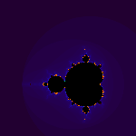
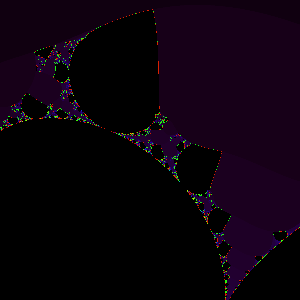

# 6brot
A mandelbrot/julia set fractal viewer. It tests the sequence $z' = z^a + c$ for divergence. When running with the default 32-bit floating point precision, $z_0, a, c \in \mathbb{C}$. When running with the `-f64`, which enables 64-bit floating point precision, it is restricted to $a = 2+0i$.
